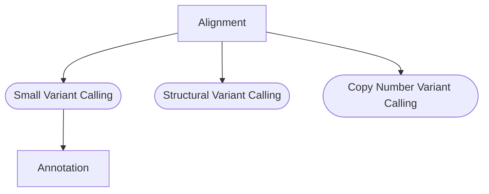

**Tempe** is a jetstream workflow supports the analysis of human sequencing
samples against the GRCh38 reference genome using ensembl version 103 gene
models. The workflow is designed to support project level analysis that can
include one or multiple types of data. Though not required the expectation is a
project contains data from a single individual thus centralizing all data types
in a standardized output structure. The workflow template supports a diverse
array of analysis methods required to analyze DNA, RNA, and single cell data.
Based on standardized variables it also supports integrated analysis between
data types. For some processes multiple options are provided that can be
individually enabled or disabled by configuration parameters. Like all
[JetStream](https://github.com/tgen/jetstream) workflows developed at TGen this
workflow is designed to facilitate our dynamic and time sensitive analysis
needs while ensuring compute and storage resources are used efficiently. The
primary input is a JSON file, that for most internal users will be generated by
the TGen LIMS.

