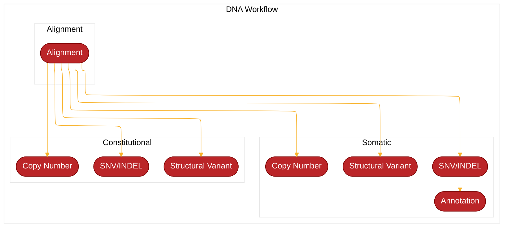
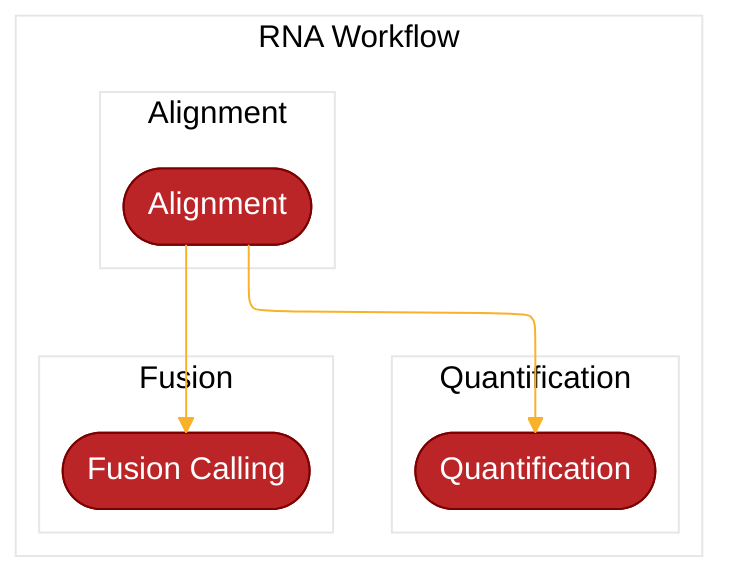

**Tempe** is a JetStream workflow supports the analysis of human sequencing
samples against the GRCh38 reference genome using ensembl version 103 gene
models. The workflow is designed to support project level analysis that can
include one or multiple types of data. Though not required the expectation is a
project contains data from a single individual thus centralizing all data types
in a standardized output structure. The workflow template supports a diverse
array of analysis methods required to analyze DNA, RNA, and single cell data.
Based on standardized variables it also supports integrated analysis between
data types. For some processes multiple options are provided that can be
individually enabled or disabled by configuration parameters. Like all
[JetStream](https://github.com/tgen/jetstream) workflows developed at TGen this
workflow is designed to facilitate our dynamic and time sensitive analysis
needs while ensuring compute and storage resources are used efficiently. The
primary input is a JSON file, that for most internal users will be generated by
the TGen LIMS. For configuring this JSON, please review the [Usage] page. Based
on this configuration, Tempe will automatically pair compatible data types
together for analysis. For example, if given both tumor and constitutional
whole genome sequencing data (tumor and normal, case and control). These will
be paired together for somatic variant calling. Similarly, if given two tumor
samples (two timepoints), and single constitutional sample, then both tumors
will separately paired with the constitutional sample. Additionally, if exome
capture sequencing data is added, it will only pair with other exomes[^1].

The Tempe pipeline can perform the following analyses:

- DNA
  - Alt-Aware Alignment
    - bwa-mem2
        - _if using UMIs, the fastqs will be preprocessed via fgbio_
  - QC Metrics
    - Samtools Stats, Flagstat, Idxstats
    - GATK CollectMultipleMetrics
  - SNV/INDEL Variant Calling
    - Deepvariant (Constitutional)
    - Freebayes (Constitutional)
    - Mutect2 (Constitutional, Paired-Somatic, and Pseudo-TumorOnly)
    - Strelka2 (Constitutional, Paired-Somatic, and Pseudo-TumorOnly)
    - Lancet (Constitutional, Paired-Somatic, and Pseudo-TumorOnly)
    - Octopus (Constitutional, Paired-Somatic, and Pseudo-TumorOnly)
    - VarDict (Constitutional, Paired-Somatic, and Pseudo-TumorOnly)
  - Structural Variant Calling
    - Manta (Constitutional, Paired-Somatic, and Pseudo-TumorOnly)
    - MM_IgTx Calling
  - Copy Number Analysis
    - iChorCNA (Constitutional)
    - GATK-CNV (Constitutional, Paired-Somatic, and Pseudo-TumorOnly)
- RNA
  - Alignment
    - STAR
  - QC Metrics
  - Quantification
    - STAR
    - Salmon
  - Fusion Calling
    - STAR-Fusion

---

### Flowchart Overview

[^1]: Additional restrictions can be enabled to only pair samples with matching assayCodes.
